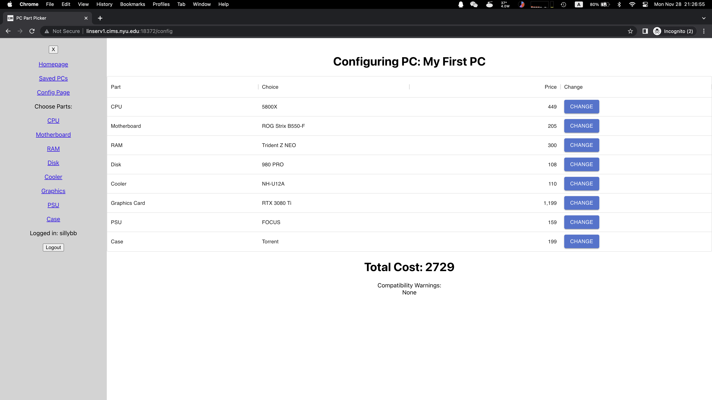
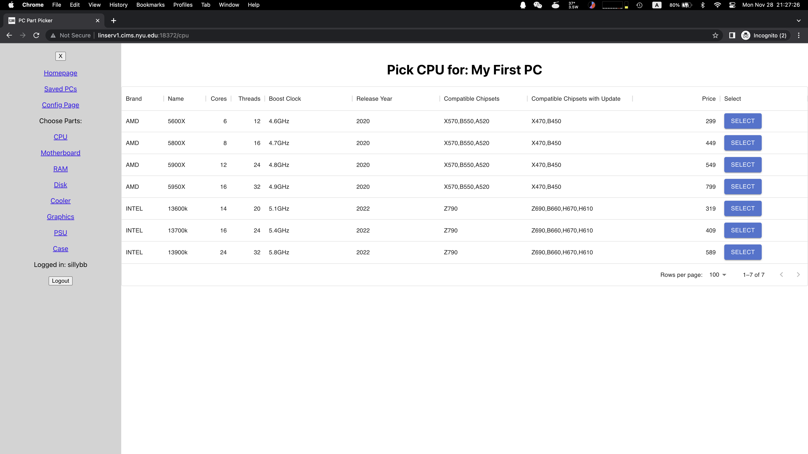

# PC Part Picker 
This project is inspired from [pcpartpicker.com](pcpartpicker.com), and my own experience as a DIY PC enthusiast. 

## Overview

Computers are an important part of modern life. Apart from buying a laptop or a pre-built desktop computer, some people prefer to build their own. It's surprisingly easy to build your own computer today, and there're tutorials on the Internet that can teach you how to do that. In addition to being cheaper than buying a prebuilt, building your own PC also means you can choose exactly what parts you want, and have a upgrade path in the future. 

PC Part Picker is a simple app that allows you to plan and configure your custom PC before you actually buy any parts. Here you can choose the 8 main parts for your PC, see the individual specs for each part, and have a MSRP value for everything at the end. 

Additional features:
* Compatibility warnings between motherboard, CPU, and RAM are implemented. 

Optional features not yet implemented: 
* allow the user to have more than 1 part of the same kind for the finished PC. Most computers only have 1 CPU package and 1 motherboard, but it's common to have 2 or more disks in the same computer. Mixing and matching RAM is not recommended, but it's possible. 
* live updating when new PC parts are released from manufactures. This data can be scraped from 3rd party websites, so that the developer don't have to manually insert a bunch of specs when new hardware comes out.
* allow the user to override some features of the app, such as ignoring incompatibility warnings or adding their own parts. 

## Data Model

This app will use 8 classes to represent computer parts:
* CPU
* Motherboard
* RAM
* Disk
* CPU Cooler
* Graphics Card
* Power Supply
* Case

Each item will have details as object properties. These properties might include their specs, compatibility, year released, and price. 
It might be somewhat better to use a relational database for this app, because the same kind of part typically have the same set of properties. However, older parts might lack such information, and there definitely exists exceptions. 

An Example Graphics Card:

```javascript
{
	name: 'RTX 3080 Ti',
	brand: 'NVIDIA',
	release_year: 2021,
	architecture: 'Ampere',
	GPU: 'GA102',
	PCIe_generation: '4.0',
	PCIe_lanes: 16,
	memory_type: 'GDDR6X',
	memory_size: '12GB',
	bus_width: 384,
	core_count: 10240,
	GPU_clock: '1365MHz',
	memory_clock: '1188MHz',
	TDP: 350,
	MSRP: 1199
}
```

An example CPU with lists as some of its properties:

```javascript
{
	name: 'Ryzen 7 5800X',
	brand: 'AMD',
	release_year: 2020,
	cores: 8,
	threads: 16,
	hyperthreading: true,
	hybrid_arch: false,
	architecture: 'zen3',
	PCIe_generation: '4.0',
	memory_type: ['DDR4'],
	base_clock: '3.8GHz',
	boost_clock: '4.7GHz',
	TDP: 105,
	unlocked: true,
	iGP: false,
	MSRP: 249,
	required_chipset: ['X570', 'B550', 'A520', '*X470', '*B450']
}
```

A CPU can only use one type of memory most of the time. In the case of 5800X, it's DDR4. However, newer CPUs from Intel supports both DDR4 and DDR5, so I used a list for this property.
It's very common for a CPU to be compatible with multiple chipsets, so it's also represented as lists here. The required_chipset list represents the chipsets compatible with the CPU; chipsets prefixed with "*" means that the corresponding motherboard might need an BIOS update to be compatible. 

In addition to those, a PC object will contain reference to those 8 parts, and a User object will contain user information and references to configured PCs. 

## [Link to Schema](db.mjs) 

## Examples

/config - page for viewing the selected components and planning the build



/CPU - page for choosing a CPU



## Site map

Site map is visible on the Navbar at the left. You can login/logout, see your saved PCs, configure a PC, and choose any of the 8 parts.

## User Stories or Use Cases

1. as non-registered user, I can register a new account with the site.
2. as a user, I can log in to the site.
3. as a user, I can create new PC builds, or access previously saved builds.
4. as a user, I can modify any of the components in my existing builds.
5. as a user, I can delete my previous builds.

## Research Topics

* (6 points) React Framework
	* React separates UI from DB, which is very suitable for this project.
	* All UI and most logics are implemented in React, while route handlers and DB CRUDs are implemented with express. 
* (3 points) dotenv
	* In order to seamlessly develop and deploy, configurations such as domain and port are handled with .env files.
	* This is especially helpful while using two separate apps, as faulty configurations can trigger CORS problems.
* (2 points) Material UI
	* Tables occupy a significant portion of this APP. 
	* To simplify work, we can use an external API for styling tables and filling in data. 

## [Link to Frontend Project File](frontend/src/App.js) 

## Annotations / References Used

1. [pcpartpicker.com](https://pcpartpicker.com/) - The main inspiration for this project
2. [Sample MERN Project](https://github.com/codrkai/node_react_mongodb_tutorial) - Framework Code Reference
3. [Video Guide on React App Structure](https://www.youtube.com/watch?v=3isCTSUdXaQ) - React App Structure
4. [Medium Tutorial on Interactive Navbar](https://medium.com/swlh/how-to-make-a-side-navigation-bar-in-reactjs-c90747f3410c) - Navbar
5. [Recoil Global State](https://recoiljs.org/) - Global State Library for React
6. [Mongoose Documentation](https://mongoosejs.com/docs/populate.html#populate_multiple_documents) - Mongoose Documentation on populate()
7. [HW Code](https://github.com/nyu-csci-ua-0467-001-002-fall-2022/homework05-lichang0824) - Homework example code for authentication
8. [Material UI](https://mui.com/material-ui/react-table/) - DataGrid component in Material UI Framework
